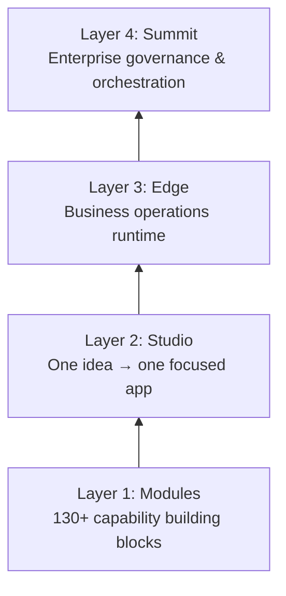
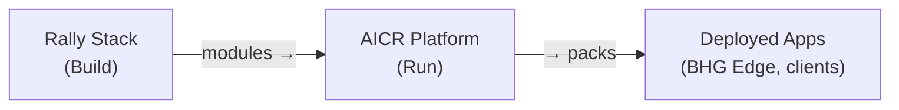
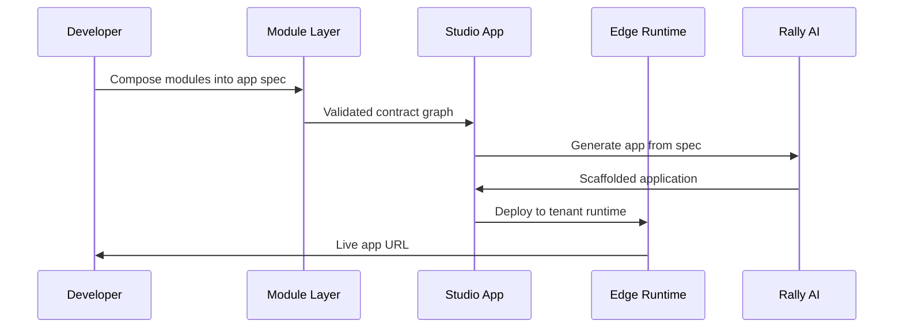

## Overview

Rally Stack is a **platform factory**: a structured system for building, composing, and deploying business applications from reusable capability modules. The architecture has four discrete layers, each building on the previous.



## The Four Layers

### Layer 1 — Modules

The foundational layer. Modules are **reusable, self-contained capability units** — they do one thing well and expose a typed contract. They are not apps; they are building blocks.

- 130+ modules across 9 categories
- Each module has a defined input/output contract
- Modules can compose with other modules
- No UI of their own — consumed by layers above

**Think of modules as the parts catalog.** Studio, Edge, and Summit are the assembled products.

### Layer 2 — Studio

Studio is the **creation layer**. One Studio app = one idea, one focused experience. Studio apps pull from the module library and expose a polished UI for a specific use case.

- Target audience: BHG developers, domain experts building point solutions
- Backed by **Creator AI** (the Studio-tier AI Lifecycle Manager)
- Three-step generation: Ideate → Create → Validate
- Apps are standalone and deployable independently

**Example:** An HR onboarding tracker, a grant application portal, a commission simulator.

### Layer 3 — Edge

Edge is the **operations layer**. Where Studio creates a point tool, Edge creates a system — connecting apps, automating workflows, and running the day-to-day of a business.

- Target audience: Mid-market clients, industry verticals, conference demos
- Backed by **Operator AI** (the Edge-tier ALM)
- 6 P's framework: People, Process, Product, Performance, Partners, Platform
- Multi-app coordination with shared data and unified UX

**BHG Edge** is BHG's own internal business operations platform, deployed at [edge.bluehorizonsgroup.com](https://edge.bluehorizonsgroup.com) — it is itself a live Edge-tier deployment.

### Layer 4 — Summit

Summit is the **governance layer**. It orchestrates multiple Edge deployments, manages pack promotion workflows, and provides enterprise-wide visibility.

- Target audience: Enterprise clients, partner channels, commercial distribution
- Backed by **Enterprise AI** (the Summit-tier ALM)
- Infinite extensions model — Summit scales across business units
- Pack marketplace, partner onboarding, and compliance controls

## Supply Chain Relationship

Rally Stack and AICR are two sides of the same supply chain:



- **Rally Stack** is the **factory** — where modules are built and composed
- **AICR** is the **runtime** — where modules are packaged as packs and deployed to tenants
- Rally Stack modules become AICR packs through a promotion workflow

## Three Laws (Locked)

Rally Stack enforces three architectural rules with no exceptions:

<Warning>
  These three laws are enforced at the platform level and cannot be overridden by configuration, flags, or agent instruction.
</Warning>

| Law | Rule | Reason |
|-----|------|--------|
| **Neon Everywhere** | All databases must use Neon serverless Postgres | Branching, instant provisioning, cost efficiency |
| **Neon Branches** | All environment isolation uses Neon branches (dev/staging/prod) | Consistent schema management |
| **Prisma Only** | Prisma ORM is the only permitted database access method | Contract enforcement, type safety, audit trails |

## Module Contracts

Every module exposes a typed contract defining:

```typescript
interface ModuleContract {
  id: string;           // unique module identifier
  version: string;      // semver
  inputs: ZodSchema;    // validated input shape
  outputs: ZodSchema;   // guaranteed output shape
  dependencies: string[]; // other modules this depends on
  aiCapable: boolean;   // whether it has an AI Lifecycle Manager
}
```

Contracts are validated at composition time — you cannot wire two modules together if their schemas don't align.

## Data Flow



## Next Steps

<CardGroup cols={2}>
  <Card title="Platform Core" icon="sitemap" href="/docs/platform/overview">
    Deep dive into the platform internals
  </Card>
  <Card title="Rally AI Framework" icon="brain" href="/docs/platform/rally-ai-framework">
    Multi-model AI orchestration
  </Card>
  <Card title="Module Library" icon="sitemap" href="/modules/overview">
    Browse all 130+ modules
  </Card>
  <Card title="Technology Stack" icon="code" href="/docs/platform/technology-stack">
    The tech powering Rally Stack
  </Card>
</CardGroup>
